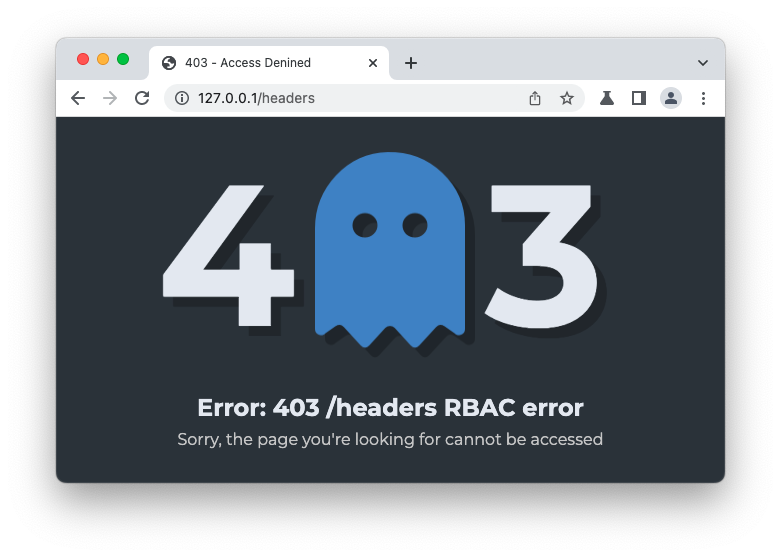

# Istio Custom 403 Error Page
## What we want to acheive
Istio will return the following page if user does not pass AuthorizationPolicy
\
These white page is nice, but we would like to make it more beautiful ... like the below


## Solution
Implementing Envoy Filter, in status_code_filter. when status code is 403, use local reply to return customized page [Envoy Proxy - local_reply](https://www.envoyproxy.io/docs/envoy/latest/configuration/http/http_conn_man/local_reply)

See original github issue at
[Customized Error response in case of origin authentication failure](https://github.com/istio/istio/issues/10543#issuecomment-921179277)

## Setup Istio
we will folow
[Istio Authentication Policy](https://istio.io/latest/docs/tasks/security/authentication/authn-policy/)

1. Download Docker Desktop and Enable Kubernate Engine [Docker Desktop Kubernetes](https://docs.docker.com/desktop/kubernetes/)
2. Download [Istio](https://istio.io/latest/docs/setup/getting-started/) and cd to istio directory
3. Copy the following shell script and execute as ordered below

```
01_docker-desktop-istio.sh
02_istio_jwt_authentication.sh
03_apply_envoy_filter.sh
```
after apply all resources. access to http://127.0.0.1/headers 

## HTML Template
Thank for Amazing CodePen from Jake Wood
https://codepen.io/Jake_Woods/pen/LYEMGpV